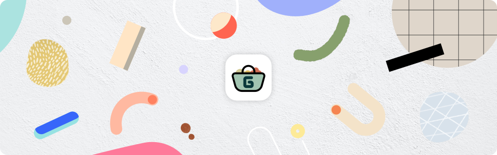
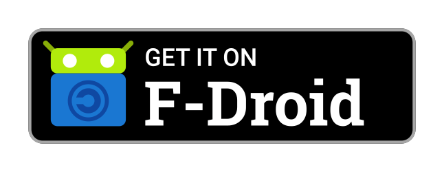
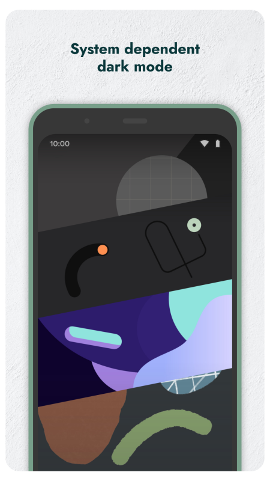
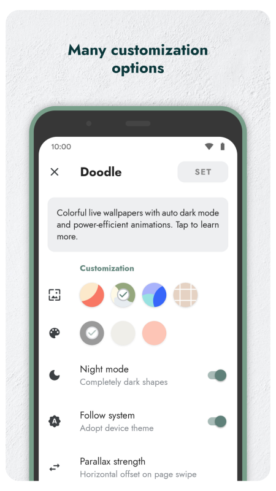
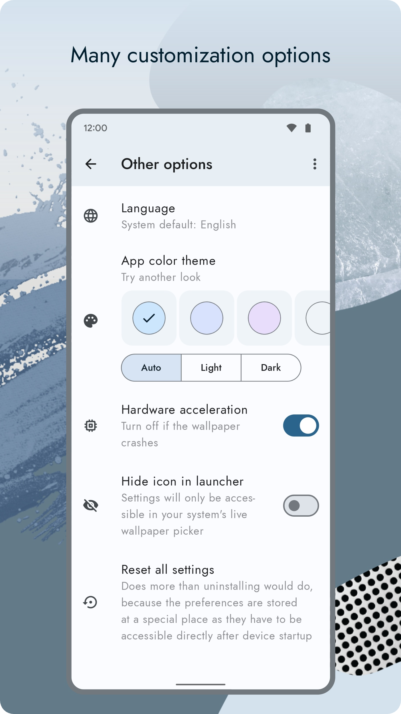

# Doodle Android: Live Wallpapers

    

Doodle Android is an open-source Android app that provides colorful live wallpapers with auto dark mode and power-efficient animations.

The wallpapers are based on the original Doodle live wallpaper collection of the Google Pixel 4 and the leaked (but never officially released) Material You static wallpaper collection of the Pixel 6, extended with additional wallpapers from Chrome OS.  
The app is not just a copy of the original wallpapers, it's a complete rewrite without the permanent animations to save battery and storage space. In addition, there are many customization options to match your preferences.

## Downloads

## Screenshots

## Features

* Stunning wallpaper designs and Pixel feeling
* System dependent dark mode
* Power-efficient parallax effect on page swipe or when tilting the device
* Optional zoom effects
* Direct boot support (immediately active after device restart)
* No ads and no analytics

## Advantages over original Pixel 4 live wallpapers

* Permanent animations (when tilting the device) are optional
* Support for Android 12 color extraction
* Exclusive "Material You"-inspired live wallpaper
* No battery-hungry 3D engine
* Improved text contrast (dark text for light themes instead of white text with shadow)
* Support for Android 11 zoom effect
* Many additional customization options
* Rendering works well even on less powerful devices (very efficient rendering engine)
* Also suitable for larger devices like tablets (scaling option available)
* Tiny installation size

## Compatibility

Doodle Android requires at least Android 5.0 Lollipop on your device. The app will work properly on devices without any Google service installed.

## Contribution

If you run into a bug or miss a feature, please [open an issue](https://github.com/patzly/doodle-android/issues) in this repository.

Doodle Android is not yet available in your language? You can help translate this project at [Transifex](https://www.transifex.com/patzly/doodle-android)!  
Translations which reached a completion level of 80% will be included in releases.

## License

Copyright &copy; 2019-2022 Patrick Zedler. All rights reserved.

[GNU General Public License version 3](https://www.gnu.org/licenses/gpl.txt)

> Doodle Android is free software: you can redistribute it and/or modify it under the terms of the GNU General Public License as published by the Free Software Foundation, either version 3 of the License, or (at your option) any later version.
>
> Doodle Android is distributed in the hope that it will be useful, but WITHOUT ANY WARRANTY; without even the implied warranty of MERCHANTABILITY or FITNESS FOR A PARTICULAR PURPOSE. See the GNU General Public License for more details.
