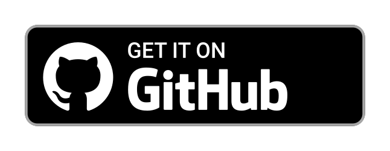

# Doodle Android – Live Wallpapers à la Pixel 4

    

Doodle Android is an open-source Android app that provides colorful live wallpapers with auto dark mode and an battery-efficient parallax effect.  
The wallpapers are based on the original Doodle live wallpapers of the Google Pixel 4.

## Download

## Features

* Stunning colors and theme variants
* System dependent dark mode
* Battery-efficient parallax effect on page swipe
* Support for Android 11 zoom effect
* Optional zoom-in animation when unlocking
* Various customization options
* Direct boot support (immediately active after device restart)
* No permanent animations or gyroscope sensor requests
* Also suitable for less powerful devices
* No ads and no analytics
* Tiny installation size (~3.5MB)

## How to set as background
* Tap SET in the top right corner, it should appear a preview
* Now tap SET WALLPAPER

## Compatibility

Doodle Android requires at least Android 6 Marshmallow on your device. The app will work properly on devices without any Google service installed.

You need to turn on background scrolling in your launcher's settings if you have disabled it before to make parallax effect work.
Some launchers don't support background scrolling at all, like Samsung's TouchWiz. As a solution, please try installing another launcher.

## License

Copyright &copy; 2021 Patrick Zedler. All rights reserved.

[GNU General Public License version 3](https://www.gnu.org/licenses/gpl.txt)

> Doodle Android is free software: you can redistribute it and/or modify it under the terms of the GNU General Public License as published by the Free Software Foundation, either version 3 of the License, or (at your option) any later version.
>
> Doodle Android is distributed in the hope that it will be useful, but WITHOUT ANY WARRANTY; without even the implied warranty of MERCHANTABILITY or FITNESS FOR A PARTICULAR PURPOSE. See the GNU General Public License for more details.
